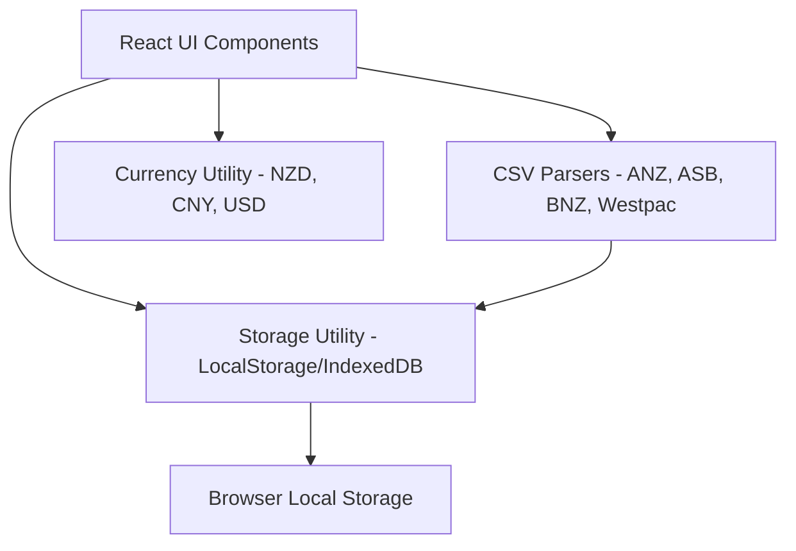

# ARCHITECTURE.md - System Architecture

This document details the architectural decisions, data models, and system components of the minimalist expense tracker.

---

## 1. Architecture Overview

The app is built as an **offline-first single-page application (SPA)**. It relies entirely on client-side compute for parsing CSV files, currency conversion, data storage, and UI updates, ensuring 100% data privacy.



---

## 2. Core System Components

### A. Local Storage & Data Models
Data is saved locally inside the browser using `localStorage`.

#### Data Structures:
```typescript
interface Transaction {
  id: string;          // UUID or generated string
  date: string;        // ISO Format YYYY-MM-DD
  payee: string;       // Cleansed merchant name
  originalPayee: string; // Raw description from CSV
  amount: number;      // Net change (negative for expenses, positive for income)
  currency: 'NZD' | 'CNY' | 'USD'; // Default is NZD
  amountNZD: number;   // Calculated amount in NZD (for unified reporting)
  rate: number;        // Exchange rate used (rate * original_amount = amountNZD)
  category: string;    // Auto-assigned or manual category (e.g. Groceries, Eating Out, Transport, Rent, Income, Others)
  bank?: string;       // Originating bank (ANZ, ASB, BNZ, Westpac, Manual)
}

interface CurrencyRates {
  NZD: number; // base 1.0
  CNY: number; // e.g., 0.22 (NZD per CNY)
  USD: number; // e.g., 1.62 (NZD per USD)
  lastUpdated: string;
}
```

### B. New Zealand Bank CSV Parser Engine
Each bank exports its transaction history in slightly different layouts. We implement a flexible strategy-pattern parser in `src/utils/csvParser.ts`.

#### Bank CSV Headers & Formats:
1.  **ANZ**:
    *   Columns: `Type`, `Details`, `Particulars`, `Code`, `Reference`, `Amount`, `Date`, `Foreign Currency Amount`
    *   Identifying feature: Contains headers `Particulars`, `Code`, `Reference` as separate columns.
2.  **ASB**:
    *   Columns: `Date`, `Unique Id`, `Tran Type`, `Cheque Number`, `Payee`, `Memo`, `Amount`
    *   Identifying feature: Has `Unique Id`, `Tran Type`, `Payee`, `Memo`.
3.  **BNZ**:
    *   Columns: `Date`, `Amount`, `Payee`, `Description`, `Reference`
    *   Identifying feature: Usually has standard `Payee`, `Description`, `Reference` without `Particulars`.
4.  **Westpac**:
    *   Columns: `Date`, `Amount`, `Other Party`, `Particulars`, `Analysis Code`, `Reference`, `Transaction Type`
    *   Identifying feature: Uses `Other Party`, `Analysis Code` instead of `Payee`.

#### Auto-Categorization Rules:
We map common New Zealand merchants using keyword scanning:
*   **Groceries**: `PAK N SAVE`, `PAK'N SAVE`, `COUNTDOWN`, `WOOLWORTHS`, `NEW WORLD`, `FOUR SQUARE`, `TAIPING`, `SANDRINGHAM SPICE`
*   **Dining/Café**: `MCDONALD`, `KFC`, `DOMINO`, `BURGER KING`, `STARBUCKS`, `CAFE`, `RESTAURANT`, `UBER EATS`
*   **Transport/Fuel**: `AT HOP`, `SNAPPER`, `METROCARD`, `BP`, `MOBIL`, `Z ENERGY`, `GULL`, `ALLIED`, `GAS`, `CALTEX`
*   **Utilities/Telecom**: `SPARK`, `ONE NZ`, `VODAFONE`, `2DEGREES`, `SKINNY`, `POWERSHOP`, `GENESIS`, `MERCURY`, `CONTACT ENERGY`
*   **Shopping**: `THE WAREHOUSE`, `KMART`, `MITRE 10`, `BUNNINGS`, `BRISCOES`, `JB HI-FI`, `KOSCO`, `TEMU`, `SHEIN`
*   **Rent/Housing**: `RENT`, `FLAT RENT`, `ACCOMMODATION`
*   **Income**: `SALARY`, `WAGES`, `IRD`, `INTEREST`

### C. Multi-Currency Input & Conversion
To support multiple currencies (`NZD`, `CNY`, `USD`) without server-side APIs:
*   We use a static currency rate model stored in settings with reasonable fallbacks.
*   Users can input foreign transactions (e.g. `100 CNY` or `50 USD`) when manually adding a record.
*   The system automatically converts the entry to NZD using the defined exchange rates for total budget calculation, but preserves the original currency and amount for visual display.
