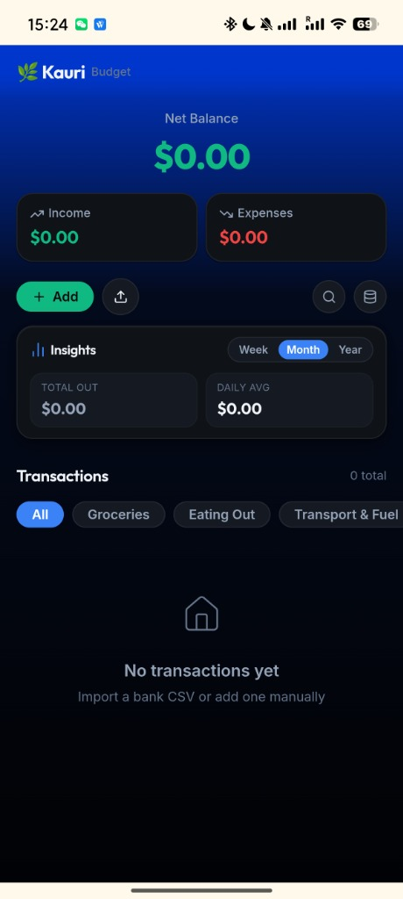

[English](README.md) | [简体中文](README.zh-CN.md)

# Kauri-Budget

🌐 Live Demo: https://kauri-budget.vercel.app/

A minimalist, privacy-first personal finance tracker tailored for New Zealanders. Designed with high-fidelity dark aesthetics and complete data sovereignty.

  

---

## Features & Advantages

*   **Offline-First & Absolute Privacy**: All your financial records are stored 100% locally within your browser's secure physical sandbox (`localStorage`). Zero cloud databases, zero data uploading, and zero tracking.
*   **Intelligent NZ Bank CSV Importer**: Simply drag and drop CSV statements from New Zealand banks (ANZ, ASB, Westpac, BNZ). Transactions are parsed, smart-categorized, and deduplicated automatically.
*   **Zero-Server Backup & Sync**: Export your ledger as a local JSON file and restore it on other devices. A built-in deduplication algorithm compares transaction fingerprints to prevent duplicated entries, enabling secure cross-device alignment without any server.
*   **Lightweight Insights**: Track your weekly, monthly, and yearly outgoings with visual progress meters highlighting your top spending category and daily averages.

---

## Tech Stack

*   **React 19 & TypeScript**: Type-safe client-side application logic.
*   **Vite**: Ultra-fast hot-reloading bundler and build tool.
*   **Vanilla CSS**: Flexible, custom-tuned responsive UI styles and design variables.
*   **Lucide React**: Clean, lightweight, scalable modern icons.

---

## Hidden Details & Tips

*   **PC Mouse Drag-to-Scroll**: On desktop browsers, you can press and drag the horizontal category filter bar with your mouse just like swiping on a phone screen.
*   **Space-Sharing Search Bar**: Clicking the 🔍 icon smoothly slides and fades out the left actions (Add and Import), allowing the search bar to organically expand horizontally using spring physics to maximize space.
*   **Dual-Overlapping Flags**: For foreign currency records (e.g., USD, CNY), the merchant logo automatically converts into a country flag overlap (e.g., 🇨🇳 over 🇳🇿), clearly displaying the original and base currency conversion path.
